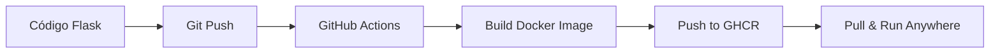

# 🧪 Flask CI Demo – API de Catálogo de Productos de Limpieza

<div align="center">


**API REST en Flask con CI/CD automatizado - Aprende Docker, GHCR y GitHub Actions** 🚀

[Demo en vivo](#-probar-la-imagen-localmente) · [Documentación API](#-aplicación-flask) · [Ver en GHCR](https://github.com/cpu-16/flask-ci-demo/pkgs/container/flask-ci-demo)

</div>

---

## 📋 Tabla de Contenidos

- [Arquitectura General](#-arquitectura-general)
- [Aplicación Flask](#-aplicación-flask)
- [Contenerización con Docker](#-contenerización-con-docker)
- [Publicación en GHCR](#-publicación-en-github-container-registry-ghcr)
- [Pipeline de CI](#-pipeline-de-ci-con-github-actions)
- [Buenas Prácticas de Seguridad](#-buenas-prácticas-de-seguridad-usadas)
- [Próximos Pasos](#-próximos-pasos-roadmap)

---

## 🎯 ¿Qué es este proyecto?

Este proyecto es una **API REST en Flask** que expone un catálogo de productos de limpieza y sirve como laboratorio para aprender:

- ✅ Contenerización con **Docker**
- ✅ Publicar imágenes en **GitHub Container Registry (GHCR)**
- ✅ Automatizar el build y publicación de la imagen con **GitHub Actions**

---

## 🏗 Arquitectura General

### Flujo completo que implementa este repo



**Paso a paso:**

1. 📝 La aplicación Flask vive en `app.py`
2. 🐳 Se construye una imagen Docker usando `Dockerfile`
3. 🔄 Al hacer `git push` a la rama `main`, GitHub Actions:
   - Hace checkout del código
   - Construye la imagen Docker
   - La publica en **GHCR** con los tags `main` y `latest`
4. 🚀 Desde cualquier máquina con Docker se puede ejecutar:

```bash
docker pull ghcr.io/cpu-16/flask-ci-demo:latest
docker run --rm -p 5000:5000 ghcr.io/cpu-16/flask-ci-demo:latest
```

### Estructura del Proyecto

```
flask-ci-demo/
├── app.py                          # Aplicación Flask principal
├── requirements.txt                # Dependencias Python
├── Dockerfile                      # Instrucciones para construir la imagen
├── .dockerignore                   # Archivos a excluir del build
├── .github/
│   └── workflows/
│       └── build-and-push.yml     # Pipeline CI/CD
├── docs/
│   └── images/
│       ├── 01-actions-green.png   # Capturas del workflow
│       ├── 02-ghcr-package.png    # Paquete en GHCR
│       └── 03-swagger-running.png # Swagger UI en ejecución
└── README.md                       # Esta documentación
```

---

## 🐍 Aplicación Flask

El archivo principal es `app.py`.

### Endpoints disponibles

#### 🏠 Ruta raíz

```http
GET /
```

Devuelve un JSON con información básica de la API.

**Respuesta:**

```json
{
  "message": "API de Catálogo de Productos de Limpieza",
  "version": "1.0.0",
  "endpoints": [
    "/catalogos/categorias",
    "/catalogos/productos",
    "/catalogos/productos/{id}"
  ]
}
```

#### 📦 Endpoints del catálogo

| Método | Ruta | Descripción |
|--------|------|-------------|
| `GET` | `/catalogos/categorias` | Lista todas las categorías disponibles |
| `GET` | `/catalogos/productos` | Lista todos los productos del catálogo |
| `GET` | `/catalogos/productos/{id}` | Devuelve un producto específico por ID |

### 📖 Documentación Interactiva

La API incluye **Swagger UI** para probar los endpoints de forma interactiva:

```
http://localhost:5000/swagger/
```


---

## 🐳 Contenerización con Docker

### Dockerfile

El proyecto incluye un `Dockerfile` basado en `python:3.11-slim` que:

1. ✅ Crea el directorio de trabajo `/app`
2. ✅ Copia `requirements.txt` e instala dependencias
3. ✅ Copia el resto del código
4. ✅ Expone el puerto `5000`
5. ✅ Ejecuta la aplicación con `python app.py`

**Dockerfile:**

```dockerfile
FROM python:3.11-slim

WORKDIR /app

COPY requirements.txt .
RUN pip install --no-cache-dir -r requirements.txt

COPY . .

EXPOSE 5000

CMD ["python", "app.py"]
```

### .dockerignore

El archivo `.dockerignore` excluye archivos innecesarios del build:

```
venv/
__pycache__/
*.pyc
.git/
.vscode/
.env
```

Esto hace que:
- 🚀 El build sea más rápido
- 📦 La imagen resultante sea más limpia y segura

### 🧪 Probar la imagen localmente

Si tienes Docker instalado:

```bash
# 1. Construir la imagen
docker build -t flask-ci-demo:dev .

# 2. Ejecutar el contenedor
docker run --rm -p 5000:5000 flask-ci-demo:dev
```

Luego abre en tu navegador:

- **API Principal:** http://localhost:5000/
- **Swagger UI:** http://localhost:5000/swagger/
- **Productos:** http://localhost:5000/catalogos/productos

---

## 📦 Publicación en GitHub Container Registry (GHCR)

Este proyecto publica automáticamente la imagen en:

```
ghcr.io/cpu-16/flask-ci-demo:main
ghcr.io/cpu-16/flask-ci-demo:latest
```


### Configuración de permisos del token

En **Settings → Actions → General → Workflow permissions** se habilitó:

✅ **Read and write permissions**

Esto permite que el token automático `GITHUB_TOKEN` tenga permiso para publicar en GHCR.

### 🔽 Hacer pull de la imagen

#### Si el paquete es público

```bash
docker pull ghcr.io/cpu-16/flask-ci-demo:latest
docker run --rm -p 5000:5000 ghcr.io/cpu-16/flask-ci-demo:latest
```

#### Si el paquete es privado

Primero autentícate en GHCR con un token personal que tenga el scope `read:packages`:

```bash
echo $GITHUB_TOKEN | docker login ghcr.io -u USERNAME --password-stdin
docker pull ghcr.io/cpu-16/flask-ci-demo:latest
```

---

## ⚙️ Pipeline de CI con GitHub Actions

El workflow vive en: `.github/workflows/build-and-push.yml`

### ¿Cuándo se ejecuta?

- ✅ En cada `push` a la rama `main`
- ✅ De forma manual desde la pestaña **Actions** (`workflow_dispatch`)


### Variables de entorno

En la sección `env` del workflow se definen:

```yaml
env:
  REGISTRY: ghcr.io
  IMAGE_NAME: ${{ github.repository }}  # owner/repo
```

Esto permite reutilizar estos valores en los pasos siguientes.

### Permisos

El job declara:

```yaml
permissions:
  contents: read      # Leer el código del repo
  packages: write     # Publicar imágenes en GHCR
  id-token: write     # Autenticación OIDC
```

### 🔧 Pasos principales del workflow

#### 1️⃣ Checkout del código

```yaml
- name: Checkout repository
  uses: actions/checkout@v4
```

#### 2️⃣ Login en GitHub Container Registry

```yaml
- name: Log in to GitHub Container Registry
  uses: docker/login-action@v3
  with:
    registry: ${{ env.REGISTRY }}
    username: ${{ github.actor }}
    password: ${{ secrets.GITHUB_TOKEN }}
```

- Usa el `GITHUB_TOKEN` que GitHub genera automáticamente
- ✅ No es necesario un token personal para publicar en GHCR

#### 3️⃣ Metadatos de la imagen (tags y labels)

```yaml
- name: Extract Docker metadata (tags, labels)
  id: meta
  uses: docker/metadata-action@v5
  with:
    images: ${{ env.REGISTRY }}/${{ env.IMAGE_NAME }}
    tags: |
      type=raw,value=latest
      type=ref,event=branch
```

Genera automáticamente:
- Tag `latest`
- Tag con el nombre de la rama (`main`)
- Labels útiles (build date, commit SHA, etc.)

#### 4️⃣ Build y push de la imagen

```yaml
- name: Build and push Docker image
  uses: docker/build-push-action@v5
  with:
    context: .
    push: true
    tags: ${{ steps.meta.outputs.tags }}
    labels: ${{ steps.meta.outputs.labels }}
```

- Construye la imagen con el contexto del repo
- Publica la imagen en GHCR con los tags generados

---

## 🔐 Buenas Prácticas de Seguridad Usadas

### ✅ No se guardan credenciales en el código

- Sin contraseñas en `Dockerfile`
- Sin tokens hardcodeados en el código

### ✅ Autenticación segura con GITHUB_TOKEN

El `GITHUB_TOKEN`:
- 🔒 Es generado automáticamente por GitHub para cada ejecución
- 🔒 Tiene permisos mínimos definidos por el workflow
- �� Se revoca al finalizar la ejecución

### ✅ .dockerignore bien configurado

Los ficheros sensibles se excluyen del build:
- `venv/` - Entornos virtuales
- `.git/` - Historial de Git
- `.env` - Variables de entorno
- `__pycache__/` - Cache de Python

### ✅ Secrets de GitHub para datos sensibles

Si se necesitan claves adicionales (para Kubernetes, por ejemplo):

1. Ve a **Settings → Secrets and variables → Actions**
2. Añade un nuevo secret
3. Refiérelo en el workflow como: `${{ secrets.NOMBRE_DEL_SECRET }}`

---

## 🚀 Próximos Pasos (Roadmap)

Algunas mejoras naturales sobre este laboratorio:

### 1️⃣ Agregar tests automáticos

- [ ] Crear un workflow `ci-tests.yml`
- [ ] Ejecutar `pytest` antes de construir la imagen
- [ ] Añadir coverage reports

```yaml
# Ejemplo de paso de testing
- name: Run tests
  run: |
    pip install pytest pytest-cov
    pytest --cov=app tests/
```

### 2️⃣ Despliegue automático a Kubernetes (k3s)

- [ ] Añadir manifests en `k8s/deployment.yaml` y `k8s/service.yaml`
- [ ] Crear un segundo workflow para deployar
- [ ] Usar `kubectl` para desplegar la imagen en un clúster k3s

### 3️⃣ Escaneo de seguridad

- [ ] Integrar **CodeQL** para análisis de código
- [ ] Añadir **Trivy** para escaneo de vulnerabilidades en contenedores
- [ ] Configurar **Dependabot** para actualizar dependencias

### 4️⃣ Documentación adicional

- [ ] Añadir más capturas de pantalla en `docs/images/`
- [ ] Crear un diagrama del flujo end-to-end
- [ ] Documentar el proceso de desarrollo → GitHub → GHCR → Kubernetes

---

## 🤝 Contribuir

¿Mejoras o sugerencias? ¡Pull requests bienvenidos!

1. Fork el proyecto
2. Crea tu rama: `git checkout -b feature/nueva-funcionalidad`
3. Commit: `git commit -m 'Añade nueva funcionalidad'`
4. Push: `git push origin feature/nueva-funcionalidad`
5. Abre un Pull Request

---

## 📄 Licencia

Este proyecto es libre de usar para propósitos educativos y de laboratorio.

---

## 🙏 Agradecimientos

- [Flask Documentation](https://flask.palletsprojects.com/)
- [Docker Documentation](https://docs.docker.com/)
- [GitHub Actions](https://docs.github.com/en/actions)
- [GitHub Container Registry](https://docs.github.com/en/packages/working-with-a-github-packages-registry/working-with-the-container-registry)

---

<div align="center">

**⭐ Si este proyecto te ayuda a aprender CI/CD, dale una estrella! ⭐**

Hecho con ❤️ para aprender DevOps y automatización

</div>
