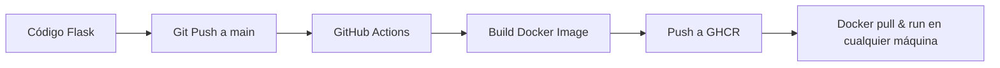
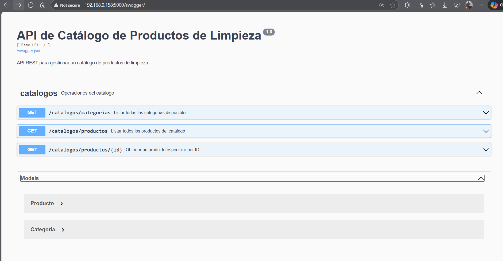
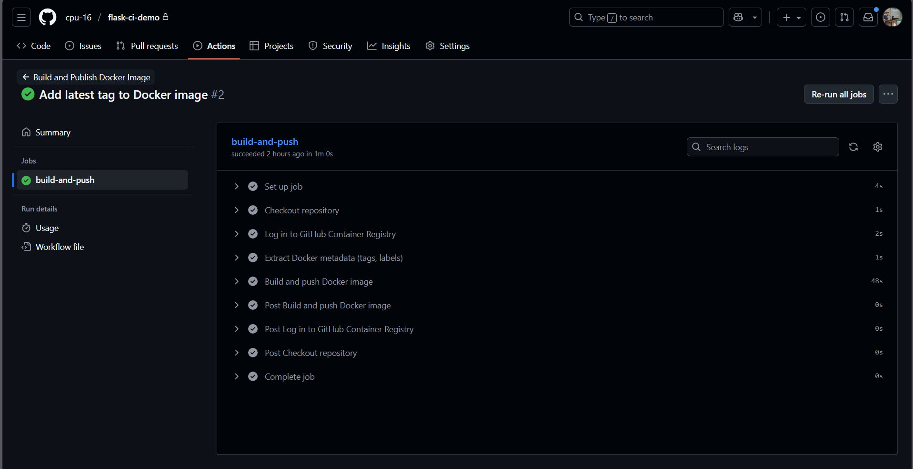
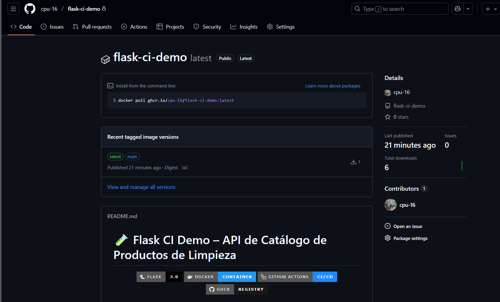
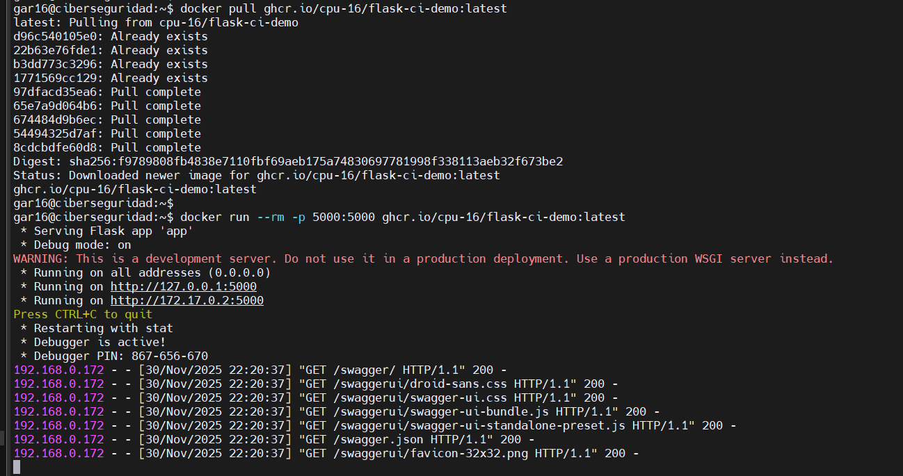

# 🧪 Flask CI Demo – API de Catálogo de Productos de Limpieza

<div align="center">


**API REST en Flask con CI/CD automatizado – laboratorio para aprender Docker, GHCR y GitHub Actions** 🚀

</div>

---

## 📋 Tabla de Contenidos

1. [¿Qué es este proyecto?](#-qué-es-este-proyecto)
2. [Arquitectura general](#-arquitectura-general)
3. [Requisitos previos](#-requisitos-previos)
4. [Paso a paso del mini-lab](#-paso-a-paso-del-mini-lab)
   - [1. Clonar el repositorio](#1-clonar-el-repositorio)
   - [2. Crear entorno virtual y ejecutar la API en local](#2-crear-entorno-virtual-y-ejecutar-la-api-en-local)
   - [3. Probar la API y Swagger](#3-probar-la-api-y-swagger)
   - [4. Construir y probar la imagen Docker local](#4-construir-y-probar-la-imagen-docker-local)
   - [5. Configurar GitHub Actions para build & push](#5-configurar-github-actions-para-build--push)
   - [6. Verificar la imagen en GitHub Container Registry](#6-verificar-la-imagen-en-github-container-registry)
   - [7. Probar la imagen desde otra máquina](#7-probar-la-imagen-desde-otra-máquina)
5. [Detalles de la aplicación Flask](#-detalles-de-la-aplicación-flask)
6. [Dockerfile y .dockerignore](#-dockerfile-y-dockerignore)
7. [Workflow de GitHub Actions](#-workflow-de-github-actions)
8. [Buenas prácticas de seguridad usadas](#-buenas-prácticas-de-seguridad-usadas)
9. [Demo en video](#-demo-en-video)
10. [Próximos pasos (Roadmap)](#-próximos-pasos-roadmap)
11. [Contribuir](#-contribuir)
12. [Licencia y agradecimientos](#-licencia-y-agradecimientos)

---

## 🎯 ¿Qué es este proyecto?

Este repositorio contiene una **API REST en Flask** que expone un catálogo de productos de limpieza y se utiliza como **laboratorio DevOps/SRE** para practicar:

- ✅ Contenerización con **Docker**
- ✅ Publicación de imágenes en **GitHub Container Registry (GHCR)**
- ✅ Automatización del build & push con **GitHub Actions** (pipeline de CI)

La idea es que puedas seguir este README como un **mini-manual** y repetir todo el flujo en tus propios proyectos.

---

## 🏗 Arquitectura general

### Flujo completo


```mermaid
graph LR
    A[Código Flask] --> B[Git Push a main]
    B --> C[GitHub Actions]
    C --> D[Build Docker Image]
    D --> E[Push a GHCR]
    E --> F[Docker pull & run en cualquier máquina]
```

### Estructura del proyecto

```
flask-ci-demo/
├── app.py                          # Aplicación Flask principal
├── requirements.txt                # Dependencias Python
├── Dockerfile                      # Instrucciones para construir la imagen
├── .dockerignore                   # Archivos a excluir del build
├── .gitignore                      # Archivos a ignorar por Git
├── .github/
│   └── workflows/
│       └── build-and-push.yml      # Pipeline CI/CD
├── docs/
│   └── images/
│       ├── swagger.png             # Captura de Swagger UI
│       ├── actions.png             # Captura del workflow
│       ├── ghcr.png                # Paquete en GHCR
│       ├── pull.png                # Pull y run de la imagen
│       └── demo.mp4                # Video de demostración
└── README.md                       # Esta documentación
```

---

## 🧰 Requisitos previos

Para seguir el laboratorio necesitas:

- Git instalado
- Python 3.11+
- Docker instalado (en la máquina donde construirás/probarás la imagen)
- Cuenta de GitHub

**Opcional:**

- WSL2 en Windows (este lab se probó con Ubuntu en WSL)
- Otra máquina Linux con Docker para probar el `docker pull` desde GHCR

---

## 🧪 Paso a paso del mini-lab

### 1. Clonar el repositorio

```bash
git clone https://github.com/cpu-16/flask-ci-demo.git
cd flask-ci-demo
```

### 2. Crear entorno virtual y ejecutar la API en local

#### 2.1 Crear y activar entorno virtual

```bash
python3 -m venv venv
source venv/bin/activate   # En Linux/WSL

# En Windows PowerShell sería:
# .\venv\Scripts\Activate.ps1
```

#### 2.2 Instalar dependencias

```bash
pip install --upgrade pip
pip install -r requirements.txt
```

#### 2.3 Ejecutar la aplicación Flask

```bash
python app.py
```

Verás algo similar en consola:

```
 * Serving Flask app 'app'
 * Debug mode: on
 * Running on http://127.0.0.1:5000
 * Running on http://0.0.0.0:5000
```

### 3. Probar la API y Swagger

Con la aplicación corriendo:

- **Información básica de la API**
  👉 http://localhost:5000/

- **Documentación interactiva (Swagger UI)**
  👉 http://localhost:5000/swagger/

- **Lista de productos**
  👉 http://localhost:5000/catalogos/productos

**Captura de ejemplo:**



### 4. Construir y probar la imagen Docker local

> **Nota:** Este paso se hace en la máquina donde tienes Docker instalado (puede ser la misma o una VM con Docker).

#### 4.1 Build local de la imagen

Desde la raíz del proyecto:

```bash
docker build -t flask-ci-demo:dev .
```

#### 4.2 Ejecutar el contenedor

```bash
docker run --rm -p 5000:5000 flask-ci-demo:dev
```

Prueba de nuevo en el navegador:

- http://localhost:5000/
- http://localhost:5000/swagger/

Si lo ves igual que en la ejecución "normal", la imagen está bien construida.

### 5. Configurar GitHub Actions para build & push

Este repo ya incluye el workflow en:

```
.github/workflows/build-and-push.yml
```

El flujo está configurado para:

- Ejecutarse automáticamente en cada push a la rama `main`.
- Construir la imagen Docker.
- Publicarla en GitHub Container Registry (GHCR) con los tags:
  - `main`
  - `latest`

#### 5.1 Ver el workflow en GitHub

1. Ve al repositorio en GitHub.
2. Abre la pestaña **Actions**.
3. Verás el workflow "Build and Publish Docker Image".
4. Cada push a `main` dispara una nueva ejecución.
5. También puedes lanzarlo manualmente si lo habilitas con `workflow_dispatch`.



### 6. Verificar la imagen en GitHub Container Registry

GitHub crea un paquete de contenedor asociado al repo.

**Pasos:**

1. En GitHub, entra al repo `flask-ci-demo`.
2. Ve a la pestaña **Packages** (o en el panel lateral).
3. Deberías ver el paquete `flask-ci-demo`.
4. Dentro verás las tags publicadas, por ejemplo:
   - `ghcr.io/cpu-16/flask-ci-demo:main`
   - `ghcr.io/cpu-16/flask-ci-demo:latest`

Desde esa página también tienes el comando sugerido para hacer `docker pull`.



### 7. Probar la imagen desde otra máquina

En una segunda máquina con Docker (por ejemplo tu servidor de laboratorio):

#### 7.1 Descargar la imagen

Si el paquete es público:

```bash
docker pull ghcr.io/cpu-16/flask-ci-demo:latest
```

Si solo tienes la tag `main`, usa:

```bash
docker pull ghcr.io/cpu-16/flask-ci-demo:main
```

#### 7.2 Ejecutar el contenedor

Con la tag `latest`:

```bash
docker run --rm -p 5000:5000 ghcr.io/cpu-16/flask-ci-demo:latest
```

o con la tag `main`:

```bash
docker run --rm -p 5000:5000 ghcr.io/cpu-16/flask-ci-demo:main
```

Vuelve a probar en el navegador (desde el cliente que tenga acceso a esa máquina):

- http://IP_DEL_SERVIDOR:5000/
- http://IP_DEL_SERVIDOR:5000/swagger/

Si todo está bien, has recorrido el flujo completo:

**Código Flask → Git push → GitHub Actions → GHCR → otra máquina con Docker ejecutando la API.**



---

## 🐍 Detalles de la aplicación Flask

El archivo principal es `app.py`.

### Endpoints principales

#### 🏠 Ruta raíz

```http
GET /
```

**Respuesta de ejemplo:**

```json
{
  "message": "API de Catálogo de Productos de Limpieza",
  "version": "1.0.0",
  "endpoints": [
    "/catalogos/categorias",
    "/catalogos/productos",
    "/catalogos/productos/{id}"
  ]
}
```

#### 📦 Endpoints del catálogo

| Método | Ruta | Descripción |
|--------|------|-------------|
| `GET` | `/catalogos/categorias` | Lista todas las categorías disponibles |
| `GET` | `/catalogos/productos` | Lista todos los productos del catálogo |
| `GET` | `/catalogos/productos/{id}` | Devuelve un producto específico por id |

---

## 🐳 Dockerfile y .dockerignore

### Dockerfile

```dockerfile
FROM python:3.11-slim

WORKDIR /app

COPY requirements.txt .
RUN pip install --no-cache-dir -r requirements.txt

COPY . .

EXPOSE 5000

CMD ["python", "app.py"]
```

### .dockerignore

```
venv/
__pycache__/
*.pyc
.git/
.vscode/
.env
```

Beneficios:

- Reduce el tamaño de la imagen.
- Acelera el build.
- Evita subir archivos sensibles/innecesarios.

---

## ⚙️ Workflow de GitHub Actions

**Archivo:** `.github/workflows/build-and-push.yml`

### Disparadores

```yaml
on:
  push:
    branches:
      - main
```

(Se puede extender con `workflow_dispatch` si quieres lanzarlo manualmente).

### Variables de entorno

```yaml
env:
  REGISTRY: ghcr.io
  IMAGE_NAME: ${{ github.repository }}  # owner/repo
```

### Permisos

```yaml
permissions:
  contents: read
  packages: write
  id-token: write
```

### Pasos principales

#### 1️⃣ Checkout del código

```yaml
- name: Checkout repository
  uses: actions/checkout@v4
```

#### 2️⃣ Login en GHCR usando GITHUB_TOKEN

```yaml
- name: Log in to GitHub Container Registry
  uses: docker/login-action@v3
  with:
    registry: ${{ env.REGISTRY }}
    username: ${{ github.actor }}
    password: ${{ secrets.GITHUB_TOKEN }}
```

#### 3️⃣ Generar tags y labels

```yaml
- name: Extract Docker metadata (tags, labels)
  id: meta
  uses: docker/metadata-action@v5
  with:
    images: ${{ env.REGISTRY }}/${{ env.IMAGE_NAME }}
    tags: |
      type=raw,value=latest
      type=ref,event=branch
```

#### 4️⃣ Build & push de la imagen

```yaml
- name: Build and push Docker image
  uses: docker/build-push-action@v5
  with:
    context: .
    push: true
    tags: ${{ steps.meta.outputs.tags }}
    labels: ${{ steps.meta.outputs.labels }}
```

---

## 🔐 Buenas prácticas de seguridad usadas

✅ **Sin credenciales en el código** (`app.py`, `Dockerfile`, etc.).

✅ **Uso de GITHUB_TOKEN** con permisos mínimos para publicar en GHCR.

✅ **.dockerignore** para evitar incluir:
   - `venv/`
   - `.git/`
   - `.env`
   - caches de Python.

✅ **Posibilidad de añadir secrets adicionales** en:
   - Settings → Secrets and variables → Actions.

---

## 🎥 Demo en video


Video demostrando:

- La ejecución de la API.
- Swagger en acción.
- El flujo de `docker pull` + `docker run`.

---

## 🚀 Próximos pasos (Roadmap)

Ideas para seguir extendiendo este laboratorio:

### Tests automáticos

- Añadir `pytest` y un workflow de pruebas.
- Bloquear el build si los tests fallan.

### Despliegue a Kubernetes (k3s en Proxmox)

- Crear `k8s/deployment.yaml` y `k8s/service.yaml`.
- Nuevo workflow `deploy-k3s.yml` que aplique los manifests.

### Escaneo de seguridad

- Integrar **CodeQL** para análisis estático.
- Escanear imágenes Docker con **Trivy**.
- Activar **Dependabot** para actualizar dependencias.

### Más documentación

- Más capturas en `docs/images/`.
- Diagrama end-to-end: Dev → GitHub → GHCR → k3s.

---

## 🤝 Contribuir

1. Haz un fork del repo.
2. Crea una rama nueva:

```bash
git checkout -b feature/nueva-funcionalidad
```

3. Haz tus cambios y commits.
4. Envía un Pull Request explicando qué mejoras aportas.

---

## 📄 Licencia y agradecimientos

Este proyecto se utiliza con fines educativos y de laboratorio.

**Gracias a:**

- [Flask](https://flask.palletsprojects.com/)
- [Docker](https://docs.docker.com/)
- [GitHub Actions](https://docs.github.com/en/actions)
- [GitHub Container Registry](https://docs.github.com/en/packages/working-with-a-github-packages-registry/working-with-the-container-registry)

---

<div align="center">

**✳️ Flask + Docker + GHCR + GitHub Actions: un mini-laboratorio perfecto para practicar CI/CD y DevOps/SRE. ✳️**

</div>
